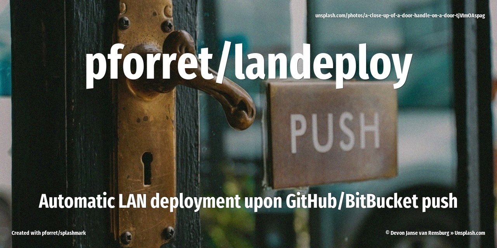

[](https://www.basher.it/package/)

# landeploy



automatic deploy on LAN/localhost upon `github/bitbucket push`, using ngrok and webhook

## 🔥 Usage

```
Program : landeploy  by peter@forret.com
Version : v1.0.0 (2025-01-01 22:16)
Purpose : automatic deploy on LAN/localhost upon 'github push'
Usage   : landeploy [-h] [-Q] [-V] [-f] [-L <LOG_DIR>] [-T <TMP_DIR>] [-B <BRANCH>] [-D <DOMAIN>] [-E <ENVIRONMENT>] [-H <HOOKS>] [-P <PORT>] [-R <REMOTE>] [-Y <REDEPLOY>] <action>
Flags, options and parameters:
    -h|--help        : [flag] show usage [default: off]
    -Q|--QUIET       : [flag] no output [default: off]
    -V|--VERBOSE     : [flag] also show debug messages [default: off]
    -f|--FORCE       : [flag] do not ask for confirmation (always yes) [default: off]
    -L|--LOG_DIR <?> : [option] folder for log files   [default: log/landeploy]
    -T|--TMP_DIR <?> : [option] folder for temp files  [default: .tmp]
    -B|--BRANCH <?>  : [option] remote repo branch  [default: main]
    -D|--DOMAIN <?>  : [option] ngrok domain to use
    -E|--ENVIRONMENT <?>: [option] deployment type (only php for now)  [default: php]
    -H|--HOOKS <?>   : [option] webhook config file  [default: landeploy.yaml]
    -P|--PORT <?>    : [option] local port for ngrok service  [default: 8008]
    -R|--REMOTE <?>  : [option] remote repo name  [default: origin]
    -Y|--REDEPLOY <?>: [option] deploy script file  [default: redeploy.sh]
    <action>         : [choice] action to perform  [options: init,serve,check,env,update]
                                                                                                                                                                                                                                                                                                                                                                 
### TIPS & EXAMPLES
* use landeploy init to do/check the installation of ngrok and webhook
  landeploy init
* use landeploy serve to start local webhook server and remote tunnel
  landeploy serve
* use landeploy check to check if this script is ready to execute and what values the options/flags are
  landeploy check
* use landeploy env to generate an example .env file
  landeploy env > .env
* use landeploy update to update to the latest version
  landeploy update
* >>> bash script created with pforret/bashew
* >>> for bash development, also check out pforret/setver and pforret/progressbar
```

## ⚡️ Examples

```bash
> landeploy --FORCE init
# install ngrok and webhook binaries, create config files

> landeploy init
# check if ngrok, webhook and all config files are OK
✅  Found binary: /usr/local/bin/ngrok                                                                                                                                                                                                                                                                                                                           
✅  Found config: Valid configuration file at /home/pforret/.config/ngrok/ngrok.yml
✅  Found binary: /usr/bin/webhook
✅  Found config: landeploy.yaml
✅  Found config: redeploy.sh

> landeploy serve
# start local webhook and remote ngrok tunnel
⏳  Starting webhook server on port 8008
Local : http://localhost:8008/hooks/redeploy
Remote: https://[customdomain].ngrok-free.app/hooks/redeploy (use this as webhook in GitHub/BitBucket)
Admin : http://localhost:4040 (use this to check what is received by ngrok)
```

## 🚀 Installation

with [basher](https://github.com/basherpm/basher)

	$ basher install pforret/landeploy

or with `git`

	$ git clone https://github.com/pforret/landeploy.git
	$ cd landeploy

The following programs are also required:

### [ngrok](https://ngrok.com/) (free):

* create a free account on [dashboard.ngrok.com](https://dashboard.ngrok.com/) - this includes 2 free endpoints (e.g. 1 for development/testing and 1 for production)
* install Linux client: [Setup & Installation](https://dashboard.ngrok.com/get-started/setup/linux) -- will happen automatically when using `landeploy --FORCE init`
```bash
curl -sSL https://ngrok-agent.s3.amazonaws.com/ngrok.asc | sudo tee /etc/apt/trusted.gpg.d/ngrok.asc >/dev/null \
&& echo "deb https://ngrok-agent.s3.amazonaws.com buster main" | sudo tee /etc/apt/sources.list.d/ngrok.list \
&& sudo apt update && sudo apt install ngrok
```

### [adnanh/webhook](https://github.com/adnanh/webhook) (Golang - open-source)

```bash
sudo apt-get install webhook
```

## 📝 Acknowledgements

* script created with [bashew](https://github.com/pforret/bashew)
* [ngrok: GitHub Repository Webhooks](https://ngrok.com/docs/integrations/github/webhooks/)

&copy; 2024 Peter Forret
